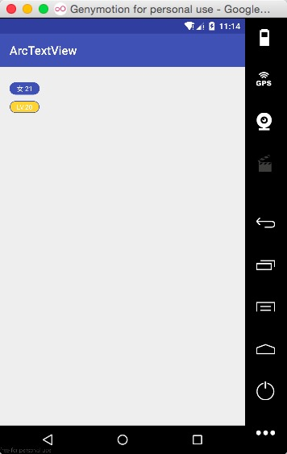

# ArcTextView



## Introduction
这是一个简单修改TextView的库，主要是实现左右圆角TextView，并且可以选择添加边框并这只边框的颜色。

##Usage

|                    属性                    |    说明    |
| :--------------------------------------: | :------: |
|           arc_background_color           |  设置背景颜色  |
|             arc_border_color             |  设置边框颜色  |
|             arc_border_width             |  设置边框宽度  |
|                  border                  | 是否有边框，默认 |
|   setBorderColor(@ColorInt int color)    |  设置边框颜色  |
| setArcBackgroundColor(@ColorInt int color) |  设置背景颜色  |
| setBorder(boolean isBorder) | 设置是否边框 |

```xml
<com.yolocc.arctextview.ArcTextView
    android:layout_width="wrap_content"
    android:layout_height="wrap_content"
    android:layout_marginTop="10dp"
    android:text="LV.20"
    android:textColor="#ffffff"
    android:textSize="11sp"
    app:arc_background_color="#fdd434"
    app:arc_border_color="@color/colorPrimary"
    app:arc_border_width="1dp"
    app:border="true"/>
```

## Import

Gradle

    dependencies {
        compile 'com.yolocc.arctextview:arctextview:1.0.1'
    }

Maven

    <dependency>
        <groupId>com.yolocc.arctextview</groupId>
        <artifactId>arctextview</artifactId>
        <version>1.0.1</version>
        <type>pom</type>
    </dependency>    

##License

	Copyright 2016 yolo.cc

    Licensed under the Apache License, Version 2.0 (the "License");
    you may not use this file except in compliance with the License.
    You may obtain a copy of the License at
    
       http://www.apache.org/licenses/LICENSE-2.0
    
    Unless required by applicable law or agreed to in writing, software
    distributed under the License is distributed on an "AS IS" BASIS,
    WITHOUT WARRANTIES OR CONDITIONS OF ANY KIND, either express or implied.
    See the License for the specific language governing permissions and
    limitations under the License.
